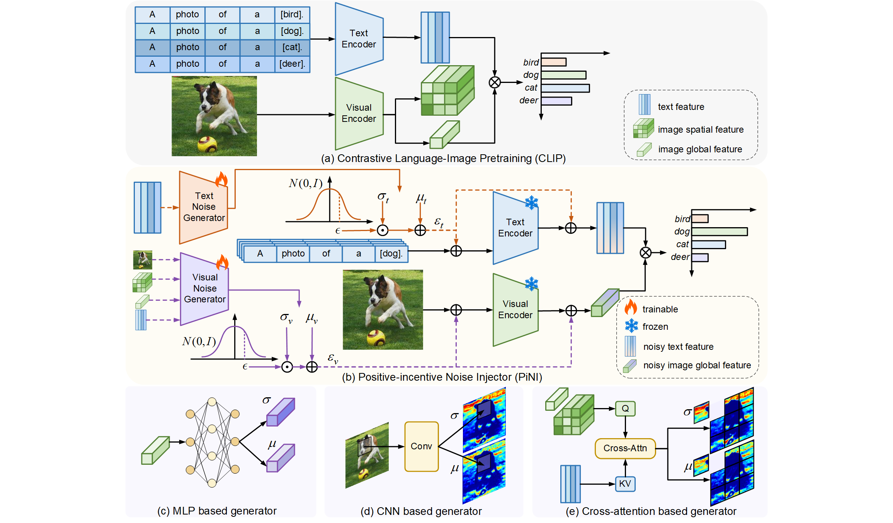

# Enhance Vision-Language Alignment with Noise (AAAI 2025)

## Introduction
This is a [Pytorch](https://pytorch.org) implementation of **PiNI**:
>   Sida Huang, Hongyuan Zhang<sup>\*</sup>, and Xuelong Li<sup>\*</sup>, "Enhance Vision-Language Alignment with Noise", in Proceedings of the AAAI Conference on Artificial Intelligence (AAAI), 2025. ([arXiv:TODO](TODO))



## Requirements
### Installation
```bash
# Install torch (requires version >= 1.8.1) and torchvision
# Please refer to https://pytorch.org/ if you need a different cuda version
conda install pytorch torchvision torchaudio pytorch-cuda=12.1
# install Dassl
cd Dassl.pytorch/
# Install dependencies in Dassl
pip install -r requirements.txt
# Install this library (no need to re-build if the source code is modified)
python setup.py develop
# install other dependencies
cd ..
pip install -r requirements.txt

```

### Dataset
Follow [DATASETS.md](DATASETS.md) to install the datasets.

## Usage
1. Modify the paths of the data and the models.
    ```bash
    # scripts/clip_vpn.sh
    DATA=/your/path/to/$DATA
    MODEL=/your/path/to/pretrained/clip/models
    ```
2. Run the code
    ```bash
    bash scripts/clip_vpn.sh DATASET CFG SHOTS
    ```
    parameters:
    
    DATASET: dataset name in configs/datasets/, such as **imagenet**

    CFG: config file name in configs/trainsers/TRAINER/, such as **imagenet_config**

    SHOTS: the number of shots in **1, 2, 4, 8, 16**

## Ackownledgement
This repo benefits from [CLIP](https://github.com/openai/CLIP), [CoOp](https://github.com/KaiyangZhou/CoOp.git). Thanks for their excellent works.

## Contact
If you have any question about this project, please contact sidahuang2001@gmail.com and hyzhang98@gmail.com.

## Citation

If you find the code useful for your research, please consider citing our work:

```
TODO
```